# 💌 Vielentines — Valentine Proposal Website Plan

> **Project:** A dedicated, multi-page Valentine's Day proposal website for **Vie**.
> **Tagline:** _"Will you be my Vielentines?"_
> **Developer:** Erlavush (Earli)
> **Target Date:** February 14, 2026
> **Repository:** `c:\ErlavushGitHubFiles\Vielentines`

---

## 📖 Table of Contents

1. [Overview & Concept](#-overview--concept)
2. [Tech Stack](#-tech-stack)
3. [Page-by-Page Blueprint](#-page-by-page-blueprint)
4. [Navigation & Flow Diagram](#-navigation--flow-diagram)
5. [GIF Sticker Asset Map](#-gif-sticker-asset-map)
6. [Email Notification System](#-email-notification-system)
7. [Design & Aesthetics](#-design--aesthetics)
8. [File & Folder Structure](#-file--folder-structure)
9. [Development Checklist](#-development-checklist)

---

## 🌟 Overview & Concept

A **single-page web application** (SPA) simulating a multi-page, swipeable experience leading to: **"Will you be my Vielentines?"**

**Pages:** 7 total (+ 5 sub-pages for the "No" gauntlet)

---

## 🛠 Tech Stack

| Layer                | Technology                                      |
| -------------------- | ----------------------------------------------- |
| **Structure**        | HTML5                                           |
| **Styling**          | Vanilla CSS3                                    |
| **Logic**            | Vanilla JavaScript (ES6+)                       |
| **Flower Animation** | Existing `flower-animation/` project (pure CSS) |
| **Email Service**    | EmailJS (free tier)                             |
| **Hosting**          | GitHub Pages                                    |

---

## 📄 Page-by-Page Blueprint

### Page 1 — The Narration (Typewriter)

**Layout:** Text centered in upper area, GIF sticker appears **below the text** (bottom of screen). Each line types out with typewriter effect, then the sticker fades in below.

| #   | Text                                                                                                                                                                                                                         | GIF Sticker                          |
| --- | ---------------------------------------------------------------------------------------------------------------------------------------------------------------------------------------------------------------------------- | ------------------------------------ |
| 1   | `"Hi vieeee sweetiee ;>"`                                                                                                                                                                                                    | GIF Sticker 1 (bear bows)            |
| 2   | `"I'm sorry it takes me so long to ask you this..."`                                                                                                                                                                         | GIF Sticker 2 (bear shy)             |
| 3   | `"I just want you to know that I've been spending a lot of time figuring out how to really ask you :<"`                                                                                                                      | GIF Sticker 3 (bear awkward)         |
| 4   | `"Which is why I made this for you ><"`                                                                                                                                                                                      | GIF Sticker 4 (bear smiling)         |
| 5   | `"All I wanted to say is that... You are the most prettiest, most elegant, most lovely, sweetest, most beautiful, most gorgeous, most wonderful, most charming, most dazzling, most radiant girl in the entire universe 💖"` | Picture 1 (photo of Vie)             |
| 6   | `"Which is why this is for you..."`                                                                                                                                                                                          | GIF Sticker 5 (bear bowing/kneeling) |

After last line: **"Swipe right →"** prompt appears.

**Sticker behavior:** No extra CSS animations on stickers — they are already animated GIFs and just appear in place.

---

### Page 2 — Flower Animation

- Full-screen flower growing animation from `flower-animation/` project.
- After animation completes: **"Slide right →"** text appears.

---

### Page 3 — The Envelope

- Animated envelope centered on screen with floating/breathing animation.
- Text: _"I have something for you... 💌"_ + _"Tap the envelope"_
- **On click:** Envelope opens → transitions to Page 4.

---

### Page 4 — The Letter (Proposal)

- Paper/letter slides out visually.
- Text (plain, no emoji):

```
Will you be my Vielentines?
```

- Two plain buttons (no animations, no emoji):

| Button  | Action                       |
| ------- | ---------------------------- |
| **YES** | → Go to Page 6 (Celebration) |
| **NO**  | → Go to Page 5.1             |

---

### Page 5 — The "No" Gauntlet (5 Sub-Pages)

**All buttons are the SAME SIZE throughout.** Stickers just appear (no extra animation — they're animated GIFs).

| Sub-Page | Message                 | GIF Sticker    |
| -------- | ----------------------- | -------------- |
| **5.1**  | _"Are you sure? 🥺"_    | GIF Sticker 6  |
| **5.2**  | _"sureee bahhh 😢"_     | GIF Sticker 7  |
| **5.3**  | _"sigeee naae T_T 💔"_  | GIF Sticker 8  |
| **5.4**  | _"vaviee pleaseeee 😭"_ | GIF Sticker 9  |
| **5.5**  | _"ahaaaayyyyy 😭😭😭"_  | GIF Sticker 10 |

**Page 5.5 Special Behavior (The Swap Trick):**

- When she clicks where the "NO" button is, the buttons **swap positions with a tiny delay** (~200ms).
- The YES button visually "clicks" (pressed animation) at the spot where NO was.
- It looks like she accidentally clicked YES — hilarious!
- Both buttons ultimately go to Page 6.

---

### Page 6 — The YES Celebration (Console Log)

Fake terminal that types out line-by-line:

```
┌──────────────────────────────────────────────────┐
│  ❤️  vielentines.exe — Console                    │
├──────────────────────────────────────────────────┤
│                                                  │
│  > Initializing vie protocol...                  │
│  > Loading feelings.dll... ████████████ 100%     │
│  > Scanning for soulmate... FOUND ✓              │
│  > Establishing connection... ██████████ 100%    │
│                                                  │
│  ✅ SUCCESS: Connection established.              │
│                                                  │
│  ❤️ Heart_Rate: ████████████████████ RISING ↑↑↑  │
│                                                  │
│  📊 Status: earli is now the luckiest, happiest  │
│            guy in the world ;>                   │
│                                                  │
│  > HUAHUAHAUHAUHAUAH < 3                         │
│                                                  │
└──────────────────────────────────────────────────┘
```

- GIF Stickers 11 & 12 appear after terminal completes.
- Confetti explosion.
- **Triggers email notification** to both addresses.

---

### Page 7 — Custom Message + Countdown

**Personal message:**

> _"Hiii vieee, sorryyy tagal ko nag ask HAUHDUAEHDUAHSUDHUAHEUHAHSD, anyway you said yes naa haaaa, this would also email you to your usep email hehe :>, anywayyyyy2 u are so prettyyyyyyyy. Look forwarddd to our valentinesss <3"_

**Valentine's Day Countdown Timer:**

- Live countdown to February 14, 2026, 00:00:00.
- Displays: Days, Hours, Minutes, Seconds (updating every second).

---

## 🗺 Navigation & Flow Diagram

```mermaid
flowchart TD
    P1["Page 1: Typewriter Narration"] -->|"Swipe right"| P2["Page 2: Flower Animation"]
    P2 -->|"Slide right"| P3["Page 3: Envelope"]
    P3 -->|"Click envelope"| P4["Page 4: Will you be my Vielentines?"]
    P4 -->|"YES"| P6["Page 6: Console Celebration"]
    P4 -->|"NO"| P5_1["5.1: Are you sure?"]
    P5_1 -->|"YES"| P6
    P5_1 -->|"NO"| P5_2["5.2: sureee bahhh"]
    P5_2 -->|"YES"| P6
    P5_2 -->|"NO"| P5_3["5.3: sigeee naae"]
    P5_3 -->|"YES"| P6
    P5_3 -->|"NO"| P5_4["5.4: vaviee pleaseeee"]
    P5_4 -->|"YES"| P6
    P5_4 -->|"NO"| P5_5["5.5: SWAP TRICK"]
    P5_5 -->|"Any click"| P6
    P6 --> P7["Page 7: Custom Message + Countdown"]
    P6 -->|"Triggers"| EMAIL["📧 Email Notification"]
```



---

## 🐻 GIF Sticker Asset Map

**Using placeholder stickers from existing `/GIFs/` folder during development.** You will replace them with the correct ones later.

| Sticker ID | Description              | Placeholder File         | Used On  |
| ---------- | ------------------------ | ------------------------ | -------- |
| Sticker 1  | Bear bows                | `hehe.gif`               | Page 1   |
| Sticker 2  | Bear shy                 | `sorry.gif`              | Page 1   |
| Sticker 3  | Bear awkward             | `please.gif`             | Page 1   |
| Sticker 4  | Bear smiling             | `hehe.gif`               | Page 1   |
| Sticker 5  | Bear bowing/kneeling     | `please.gif`             | Page 1   |
| Picture 1  | Photo of Vie             | `hehe.gif` (placeholder) | Page 1   |
| Sticker 6  | Bear showing flower      | `hehe.gif`               | Page 5.1 |
| Sticker 7  | Bear cute                | `hehe.gif`               | Page 5.2 |
| Sticker 8  | Bear kinda sad           | `sorry.gif`              | Page 5.3 |
| Sticker 9  | Bear crying              | `please.gif`             | Page 5.4 |
| Sticker 10 | Bear aggressively crying | `angry.gif`              | Page 5.5 |
| Sticker 11 | Bear very happy          | `yey-spinning.gif`       | Page 6   |
| Sticker 12 | Bear kissing girl bear   | `hehe.gif`               | Page 6   |

---

## 📧 Email Notification System

**Service:** EmailJS (free, browser-only, no backend).

| Recipient   | Email                            |
| ----------- | -------------------------------- |
| You (Earli) | `ejbdelgado01322@usep.edu.ph`    |
| Vie         | `empmara01202400407@usep.edu.ph` |

Triggered when Page 6 loads (she said YES).

---

## 4. Design Aesthetics

- **Theme:** **"Blue & Dreamy"** (Changed from Pink/Red)
  - **Primary Colors:** Soft Blues (`#c5daf6`), White, and Deep Blue accents.
  - **Vibe:** Cloud-like, dreamy, sincere, and calming.
- **Typography:**
  - _Headings/Fun Text:_ **"Freckle Face"** (Playful, handwritten feel).
  - _Body/Buttons:_ **"Poppins"** (Clean, modern).
  - _Terminal:_ **"Fira Code"** (Monospace for the "hacker" page).
  - _Script:_ **"Dancing Script"** (For romantic accents).
- **Animations:**
  - Smooth **fade transitions** between pages (replacing slide effects).
  - Floating hearts (customized to blue/white).
  - Typewriter effects for narration.
  - "No" button evasion (The "Swap Trick").
- **Music:** Background music (optional/user-controlled).

---

## 📁 File & Folder Structure

```
Vielentines/
├── index.html
├── css/
│   └── style.css
├── js/
│   └── app.js
├── GIFs/
│   ├── angry.gif
│   ├── hehe.gif
│   ├── please.gif
│   ├── sorry.gif
│   └── yey-spinning.gif
├── flower-animation/
│   └── (existing project)
└── VIELENTINES_PLAN.md
```

---

## ✅ Development Checklist

- [ ] Build `index.html` with all page containers
- [ ] Build `css/style.css` with all styling
- [ ] Build `js/app.js` with all logic
- [ ] Page 1: Typewriter + stickers below text
- [ ] Page 2: Flower animation integration
- [ ] Page 3: Envelope click interaction
- [ ] Page 4: Plain proposal + YES/NO buttons
- [ ] Page 5.1–5.5: "No" gauntlet with swap trick
- [ ] Page 6: Fake console + confetti + email
- [ ] Page 7: Custom message + countdown timer
- [ ] Mobile swipe navigation
- [ ] Email integration (EmailJS)
- [ ] Test full flow
